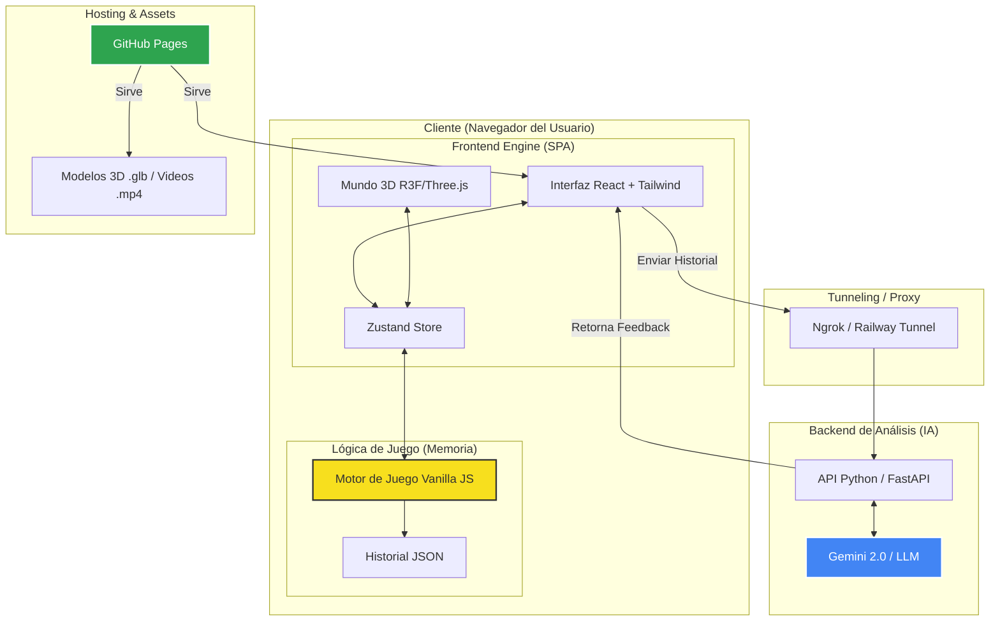

# Documentación General del Proyecto — FinaMente

Bienvenido a la documentación oficial de **FinaMente**, un simulador financiero gamificado. Este documento se centra exclusivamente en la arquitectura, componentes y flujo del **Frontend**, omitiendo los detalles técnicos internos del Motor de Juego para facilitar la comprensión de la interfaz y la experiencia de usuario.

---

## 📌 Índice del Frontend

1.  [**Arquitectura de Presentación**](#1-arquitectura-de-presentación)
    *   FinaMente como Single Page Application (SPA).
    *   Desacoplamiento Estricto: El Motor vs. La Vista.
2.  [**Gestión de Estado Global (Zustand)**](#2-gestión-de-estado-global-zustand)
    *   Sincronización Escena-Lógica.
    *   Resolución de Interacciones Asíncronas.
3.  [**Sistema de Vistas Dinámicas**](#3-sistema-de-vistas-dinámicas)
    *   Navegación 2D (Inicio, Selección de Perfil, Cinemáticas).
    *   El Núcleo 3D (Mapa y Exploración).
    *   Interfaz de Combate Financiero (Battle System).
4.  [**Controladores e Interacción 3D**](#4-controladores-e-interacción-3d)
    *   Manejo de Raycasting y Colisiones Propias.
    *   HUD compartido y Paneles Deslizables.
5.  [**Integración con Inteligencia Artificial**](#5-integración-con-inteligencia-artificial)
    *   Consumo de API de Análisis Post-Partida.
    *   Presentación del Feedback Educativo.
6.  [**Diagrama de Despliegue**](#6-diagrama-de-despliegue)

---

## 1. Arquitectura de Presentación

FinaMente está construido utilizando **React** como framework base y **Three.js** (vía `@react-three/fiber`) para la renderización del mundo tridimensional.

### Desacoplamiento Estricto
La aplicación sigue un patrón de diseño donde el Frontend actúa como una "terminal tonta" pero altamente interactiva. El Frontend no realiza cálculos de intereses ni gestiona el saldo del jugador por sí mismo; en su lugar, espera instrucciones del Motor de Juego (Vanilla JS) y traduce esas instrucciones en interfaces visuales (Vistas).

---

## 2. Gestión de Estado Global (Zustand)

El corazón de la coordinación reside en `src/store/gameStore.js`. Este almacén centraliza:
*   **Escena Activa**: Determina si se muestra el Mapa, el Combate, o los Menús Iniciales.
*   **Datos de Interacción**: Almacena temporalmente los gastos o menús que el motor solicita mostrar.
*   **Gestión de Promesas**: Implementa el mecanismo de "pausa" del motor. Cuando el motor pide una decisión, React guarda el `resolve` de la promesa en el store. Al hacer clic en un botón, React ejecuta ese `resolve`, permitiendo que el motor continúe su ejecución.

---

## 3. Sistema de Vistas Dinámicas

El flujo visual se divide en tres categorías principales:

### Navegación 2D y Cinemáticas
Utiliza **TailwindCSS** para una interfaz moderna y fluida. Incluye las pantallas de bienvenida, selección de personajes con sus respectivos videos de trasfondo, y selección de dificultad (que inicializa el motor).

### El Núcleo 3D (Mapa)
Usa **React Three Fiber** para pintar la ciudad. Las zonas de interés se destacan mediante indicadores visuales (flechas animadas) que aparecen solo cuando hay una misión pendiente en esa ubicación.

### Interfaz de Combate Financiero
`BatallaView.jsx` transforma los gastos en "enemigos" visuales. El usuario debe decidir cómo enfrentarlos (Efectivo, TDC, MSI o Ignorar), validando localmente la viabilidad de la transacción antes de enviar la orden al motor.

---

## 4. Controladores e Interacción 3D

Para mantener el rendimiento en dispositivos móviles y web, se implementan controladores ligeros:
*   **PersonajeController**: Gestiona el movimiento del avatar en el plano XZ usando trigonometría simple para colisiones circulares, evitando el peso de un motor de física complejo.
*   **Raycasting**: Permite detectar clics en edificios o elementos 3D para activar transiciones de escena.
*   **SharedHUD**: Una interfaz persistente que muestra el HP (Viabilidad Financiera), Saldo y Calidad de Vida, con la capacidad de ocultarse para una inmersión completa en el mapa.

---

## 5. Integración con Inteligencia Artificial

Al concluir la partida (Victoria o Game Over), el Frontend recopila el historial completo generado por el motor y lo envía a un Backend externo (Python + Gemini API).
*   **Comunicación**: Se utiliza un sistema de Fallback automático entre Ngrok (Desarrollo) y Railway (Producción).
*   **Resultados**: El feedback se recibe como un análisis educativo que se renderiza dinámicamente en la pantalla final para proporcionar valor pedagógico al jugador.

---

## 6. Diagrama de Despliegue

A continuación se muestra cómo interactúan los diferentes componentes del ecosistema FinaMente en un entorno de producción.

---

*Documentación generada para el equipo de desarrollo de FinaMente - 2026.*
