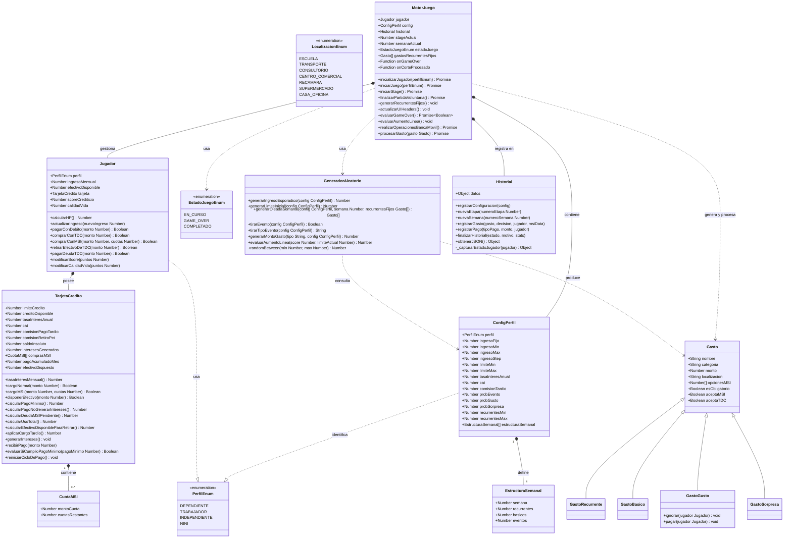

---

# 🎮 FinaMente — Informe General de Gameplay v5

---

# 1. Arquitectura General del Sistema

FinaMente es un simulador financiero gamificado de **6 etapas (meses)** que modela decisiones financieras reales bajo presión económica y temporal.

El objetivo del sistema es enseñar:

* Planeación financiera
* Uso responsable del crédito
* Manejo de liquidez
* Balance entre bienestar y solvencia

---

## Interacción Front / Back (lógico)

El sistema se divide en dos dominios bien separados:

### Backend lógico — Motor del juego

Implementado en:

```text
Vanilla JavaScript
```

Responsable de:

* Generación financiera
* Cálculos matemáticos
* Estados del juego
* Persistencia lógica (Historial JSON estructurado)
* Generación probabilística
* Emisión de callbacks de eventos (onGameOver, onCorteProcesado)

Salida:

```text
JSON estructurado con historial completo de etapas, semanas y eventos
```

---

### Frontend visual

Implementado en:

```text
React + Three.js
```

Responsable de:

* Renderizar mapa
* Mostrar gastos como enemigos
* Mostrar HUD financiero
* Animaciones
* Interacciones visuales
* Consumo de API de análisis IA post-partida

El frontend:

```text
NO contiene lógica financiera
```

Solo visualización y comunicación con la API externa.

---

## Separación de Responsabilidades

| Capa                 | Responsabilidad                        |
| -------------------- | -------------------------------------- |
| `MotorJuego`         | Lógica financiera global + callbacks   |
| `GeneradorAleatorio` | Aleatoriedad financiera                |
| `ConfigPerfil`       | Configuración estática por perfil      |
| `TarjetaCredito`     | Cálculos financieros de la tarjeta     |
| `Jugador`            | Estado económico del jugador           |
| `Historial`          | Registro estructurado JSON de partida  |
| React + Three.js     | Visualización e interacción            |
| API Backend          | Análisis educativo IA post-partida     |

---

# 2. Inicialización del Juego

Al seleccionar un perfil:

```text
MotorJuego.inicializarJugador(perfil)
```

Se ejecutan:

1. Cargar `ConfigPerfil`
2. Generar límite inicial
3. Crear tarjeta
4. Crear jugador
5. Registrar configuración en `Historial`
6. Generar recurrentes fijos
7. Inicializar métricas narrativas

---

## Valores iniciales por perfil

| Perfil        | Ingreso mensual             | Límite crédito | Tasa anual | CAT    |
| ------------- | --------------------------- | -------------- | ---------- | ------ |
| Dependiente   | $2,000 (fijo)               | $500–$1,000    | 98.5%      | 158.3% |
| Trabajador    | $5,000–$7,000 (aleatorio)   | $4,000–$10,000 | 76.9%      | 136%   |
| Independiente | $9,600 (fijo)               | $6,000–$16,000 | 55%        | 75%    |
| **NINI**      | $500–$2,000 (esporádico)    | $500–$2,000    | 122%       | 148.5% |

---

# 3. Atributos del Jugador

```javascript
Jugador {
 perfil
 ingresoMensual
 efectivoDisponible
 tarjeta
 scoreCrediticio
 calidadVida
}
```

---

## HP — Viabilidad financiera

```text
HP = ingresoMensual − pagoMinimo
```

Si:

```text
HP ≤ 0 → GAME OVER
```

---

## Calidad de Vida (CV)

Indicador narrativo.

```text
Escala: 0 – 100
Inicial: 50
```

### Reglas:

| Evento        | Cambio CV           |
| ------------- | ------------------- |
| Pagar gusto   | + floor(monto / 75) |
| Ignorar gusto | − floor(monto / 75) |
| Game Over     | CV se congela       |

Importante:

```text
CV NO afecta Score
CV NO afecta deuda
CV solo narrativa
```

---

# 4. Sistema de Localizaciones

Cada gasto aparece en una localización del mapa.

---

## Enum de Localizaciones

```text
ESCUELA
TRANSPORTE
CONSULTORIO
CENTRO_COMERCIAL
RECAMARA
SUPERMERCADO
CASA_OFICINA
```

---

## Costos dinámicos por localización

Cada gasto define:

```javascript
localizaciones: {
 Supermercado: { modMonto: 1.0 },
 CasaOficina:  { modMonto: 1.15 }
}
```

Monto real:

```text
montoFinal = montoBase × modMonto
```

Esto simula:

* recargos
* delivery
* precios urbanos

---

# 5. Estructura de Stage

Cada stage = 1 mes.

Cada mes tiene:

```text
4 semanas
```

---

## Distribución semanal

| Semana | Tipo                  |
| ------ | --------------------- |
| 1      | Recurrentes + básicos |
| 2      | Básicos + eventos     |
| 3      | Básicos + eventos     |
| 4      | Cierre + corte        |

---

# 6. Recurrentes Fijos

---

## Generación

Solo en:

```text
Mes 1
```

Después:

```text
Se congelan hasta Mes 6
```

---

## Reglas

* Aparecen siempre en:

```text
Semana 1
```

* Localización:

```text
RECAMARA
```

Esto permite:

```text
Planeación financiera real
```

---

# 7. Tipos de Gastos

| Tipo       | Obligatorio | MSI      |
| ---------- | ----------- | -------- |
| Recurrente | Sí          | No       |
| Básico     | Sí          | Limitado |
| Gusto      | No          | Sí       |
| Sorpresa   | Sí          | Sí       |

---

# 8. Sistema MSI v2

Sistema completamente rediseñado.

---

## Reglas nuevas

MSI disponible si:

```text
Hay crédito suficiente
```

(No depende de score)

---

## Bloqueo de crédito

```text
creditoDisponible -= montoTotal
```

---

## Impacto mensual

Cada mes:

```text
cuotaMSI → se suma al pago mínimo
```

Esto reduce:

```text
HP automáticamente
```

---

## Liberación de crédito

Se libera:

```text
proporcionalmente por cuota pagada
```

---

# 9. Disposición de Efectivo desde TDC

Permite obtener liquidez inmediata.

---

## Límites por perfil

| Perfil        | Retiro máximo | Comisión |
| ------------- | ------------- | -------- |
| Dependiente   | 30%           | 9%       |
| Trabajador    | 50%           | 8%       |
| Independiente | 70%           | 7%       |
| NINI          | 40%           | 9%       |

---

## Costo real

```text
Comisión = monto × porcentaje
IVA = comisión × 0.16
CostoTotal = comisión + IVA
```

IVA:

```text
NO aplica sobre capital
```

---

# 10. Indicador: Pago para No Generar Intereses

Nueva métrica clave.

---

## Cálculo

```text
PagoNoIntereses =
 saldoInsoluto
 + intereses
 + IVA
```

Si se paga:

```text
No se generan intereses el mes siguiente
```

---

# 11. Sistema de Score Crediticio

Escala:

```text
0 – 100
```

---

## Impacto por uso

| Uso    | Score |
| ------ | ----- |
| < 60%  | +5    |
| 60–89% | 0     |
| ≥ 90%  | −5    |

---

## Impacto por pago

| Acción              | Score |
| ------------------- | ----- |
| Pago total semana 1 | +10   |
| Pago total semana 2 | +5    |
| Pago mínimo         | 0     |
| No pago             | −20   |

---

# 12. Sistema de Liquidez

Nueva capa económica crítica.

---

## Flujo de liquidez

Jugador puede:

* Usar efectivo
* Usar TDC
* Retirar efectivo

Pero:

```text
Efectivo limitado
Crédito limitado
Retiro limitado
```

Esto crea presión realista.

---

# 13. Condiciones de Game Over

Existen **tres rutas**.

---

## Game Over Financiero

```text
HP ≤ 0
```

Jugador no puede pagar mínimo. Se evalúa en cada acción.

---

## Game Over por Crisis de Liquidez (Insolvencia)

Se activa si:

1. Gasto requiere efectivo
2. No hay efectivo suficiente
3. No puede retirar efectivo de TDC

Esto simula:

```text
Insolvencia inmediata
```

---

## Game Over por Insolvencia Extrema

Se activa si:

1. El gasto es obligatorio y solo acepta efectivo
2. El efectivo + la disposición máxima posible de TDC no alcanza para cubrirlo

El motor lanza `mostrarGameOverInsolvenciaExtrema` y finaliza el historial con motivo `INSOLVENCIA_EXTREMA`.

---

# 14. Economía Base del Juego

Balance financiero general.

---

## Distribución económica

```text
75–80% ingreso → gastos obligatorios
20–25% ingreso → estrategia
```

Esto fuerza:

```text
Toma de decisiones reales
```

---

# 15. Navegación Global

Sistema UX.

---

## Banca móvil ubicua

Disponible:

```text
Desde cualquier localización
```

Acceso:

```text
Tecla: p
```

Permite:

* pagar deuda (mínimo, total o parcial)
* retirar efectivo con comisión e IVA
* revisar estado financiero

---

## Salida voluntaria

```text
Tecla: x
```

Permite terminar partida.

Excepto:

```text
Durante combate activo
```

---

# 16. Perfil NINI

Perfil económico de alta variabilidad. **NINI absorbe la lógica del antiguo perfil Esporádico** — es el único perfil cuyo ingreso varía aleatoriamente cada mes.

---

## Características

```text
Ingreso Stage 1: $1,000 (fijo de arranque)
Ingreso desde Stage 2: $500–$2,000 (esporádico, cambia cada mes)
Alta variabilidad
Crédito accesible pero costoso
Alto riesgo financiero
```

---

## Lógica de Ingreso Esporádico

A diferencia de los demás perfiles, el ingreso del NINI se regenera **aleatoriamente entre $500 y $2,000** al inicio de cada mes (Stage 2 en adelante). Esto obliga a planear bajo incertidumbre.

```javascript
// ConfigPerfil del NINI
ingresoStage1: 1000,          // Arranque fijo
ingresoMinEsporadico: 500,    // Mínimo posible por mes
ingresoMaxEsporadico: 2000,   // Máximo posible por mes
ingresoStep: 250              // Incremento de la aleatoriedad
```

---

## Restricciones

No genera gastos en:

```text
ESCUELA
```

---

# 17. Sistema de Historial y Auditoría Inteligente

Todas las acciones del jugador se registran mediante la clase `Historial`, que produce un JSON estructurado enviado al backend para análisis educativo con IA.

---

## Estructura del Historial JSON

```javascript
{
  perfil: { /* ConfigPerfil normalizada */ },
  etapas: [
    {
      stage: 1,
      semanas: [
        {
          semana: 1,
          eventos: [
            {
              tipo: "gasto",
              gasto: {
                nombre, monto, formaPago,
                msiElegido, msiPeriodoActual, omitido
              },
              estadoJugador: {
                saldoTDC, creditoDisponible,
                efectivoDisponible, calidad, hp, pagoMinimo
              }
            },
            {
              tipo: "pago",
              pago: { metodo, monto },
              estadoJugador: { /* snapshot */ }
            }
          ]
        }
      ]
    }
  ],
  resultadoFinal: {
    estado: "VICTORIA" | "GAME_OVER",
    motivo: "COMPLETADO" | "HP_CERO" | "INSOLVENCIA" | "INSOLVENCIA_EXTREMA" | "VOLUNTARIO",
    stats: { hp, score, cv, pagoMinimo, pagoNoIntereses, nuevoIngreso }
  }
}
```

### Normalización de Perfiles

El `Historial` normaliza automáticamente los campos de ingreso para que el backend siempre reciba `ingresoMin` e `ingresoMax`, sin importar si el perfil usa `ingresoFijo` o `ingresoMinEsporadico/ingresoMaxEsporadico`.

---

## Snapshots de Estado

Cada evento captura una "foto" del estado del jugador al momento de ocurrir:

```javascript
estadoJugador: {
 saldoTDC,
 creditoDisponible,
 efectivoDisponible,
 calidad,       // Calidad de Vida
 hp,
 pagoMinimo
}
```

---

# 18. Callbacks de Eventos del Motor (Hooks de Integración)

El motor expone dos callbacks para integración con frameworks externos (React):

| Callback | Cuándo se dispara | Dato recibido |
| -------- | ----------------- | ------------- |
| `onGameOver(historialJSON)` | Victoria, derrota por HP, insolvencia, salida voluntaria | JSON completo del `Historial` |
| `onCorteProcesado(stats)` | Al finalizar cada mes (stage) | `{ hp, score, cv, pagoMinimo, pagoNoIntereses, nuevoIngreso }` |

**Puntos de activación de `onGameOver`:**

1. **Victoria** — Stage 6 completado exitosamente
2. **Derrota por HP** — `HP ≤ 0` al evaluar game over
3. **Insolvencia** — El usuario no puede pagar un gasto (sin efectivo ni crédito)
4. **Insolvencia Extrema** — Gasto obligatorio sin efectivo + sin disposición posible
5. **Salida Voluntaria** — El usuario elige salir `x` o `confirmarAvance → 'salir'`

```javascript
// En React:
motor.onGameOver = async (historialJSON) => {
  vista.mostrarCargandoAnalisis();
  const result = await solicitarAnalisisIA(historialJSON);
  vista.mostrarFeedbackAPI(result.feedback);
};

motor.onCorteProcesado = (stats) => {
  // Disparar animaciones de fin de mes, actualizar dashboard, etc.
  console.log("Mes finalizado:", stats);
};
```

---

# 19. Integración con API de Análisis IA

Al terminar la partida (por cualquier causa), el sistema envía el historial al backend para obtener feedback educativo personalizado.

---

## Arquitectura de Red — Fallback Invisible

Implementado en `apiUtils.js`:

* **Plan A**: `https://stag-improved-wildcat.ngrok-free.app/partida/analizar` (ngrok)
* **Plan B**: `https://finamente-production.up.railway.app/partida/analizar` (Railway)

Si el Plan A falla o no está disponible, el sistema conmuta automáticamente al Plan B **sin alertar al usuario**.

---

## Flujo de Ejecución Post-Partida

```text
1. MotorJuego dispara onGameOver(historialJSON)
2. Vista muestra indicador: "🧬 Analizando tu partida con IA..."
3. fetch POST al backend con el JSON del Historial
4. Backend responde con { feedback }
5. Vista renderiza el feedback educativo personalizado
```

**Resiliencia:** Si la API está fuera de línea, el juego termina normalmente mostrando una advertencia informativa. La experiencia del usuario no se interrumpe.

---

# 20. Modelo Conceptual del Gasto

Modelo modular con herencia.

---

```javascript
{
 nombre,
 categoria,
 monto,
 esObligatorio,
 aceptaMSI,
 aceptaTDC,

 localizaciones: {
   SUPERMERCADO: { modMonto: 1.0 },
   CASA_OFICINA: { modMonto: 1.15 }
 }
}
```

Subclases:

| Clase | Comportamiento especial |
| ----- | ----------------------- |
| `GastoRecurrente` | Fijo desde Mes 1, siempre en RECAMARA |
| `GastoBasico` | Obligatorio, aparece semanalmente |
| `GastoGusto` | Ignorable, afecta Calidad de Vida |
| `GastoSorpresa` | Obligatorio, puede incluir MSI |

Esto permite:

```text
Costos dinámicos
Escalabilidad
Extensión futura
```

---

# 21. Curva de Aprendizaje

Sistema educativo progresivo.

---

## Stage 1

* Sin multas
* Sin castigos severos

---

## Stage 2+

Se activan:

```text
Recordatorios de pago
Consecuencias reales (cargo tardío, -20 score)
Advertencia de último día para pago mínimo
```

---

## Stage 6

```text
Ventana de pago inmediata al terminar
El jugador debe liquidar su cuenta antes de finalizar
```

---

# 22. Estado Final del Juego

El juego termina cuando:

```text
Stage 6 completado
```

O:

```text
Game Over (HP, Insolvencia, Insolvencia Extrema)
```

O:

```text
Salida Voluntaria
```

En todos los casos, `onGameOver` se dispara con el historial completo.

---

# Resultado

Este documento **v5** ya contiene:

* Todas las mecánicas nuevas integradas
* Clase `Historial` con estructura JSON detallada
* Callbacks `onGameOver` y `onCorteProcesado`
* Sistema de API con fallback invisible
* Tres rutas de Game Over diferenciadas
* Arquitectura coherente y desacoplada
* Flujo financiero realista
* Base sólida para implementación React + Three.js

---


