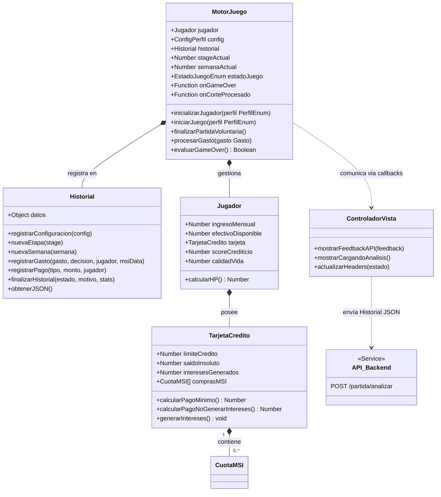

# 📄 Reporte de Integración: Historial y API de Análisis (v1.1)

Este reporte detalla las modificaciones realizadas en el motor de juego (`src/core/motor`) y la interfaz de la demo (`src/core/demo_motor`) para integrar la persistencia de logs y el análisis educativo mediante IA.

---

## 1. Integración del Historial de Partida

Se implementó una nueva clase `Historial` encargada de estructurar todos los eventos financieros en un formato JSON jerárquico compatible con el backend.

- **Captura Cronológica**: Se registran etapas (meses), semanas y eventos discretos (gastos, pagos de tarjeta, retiros de efectivo).
- **Snapshots de Estado**: Cada evento captura una "foto" del estado del jugador (`HP`, `Efectivo`, `Crédito`, `Score`, `Calidad de Vida`) para permitir a la IA analizar la tendencia.
- **Normalización de Perfiles**: El historial ahora normaliza los diferentes tipos de ingresos (`fijo`, `variable`, `esporádico`) para que el backend siempre reciba los campos `ingresoMin` e `ingresoMax`, evitando análisis erróneos por falta de datos.

---

## 2. Consumo de API (Frontend)

La lógica de comunicación con el servidor se centralizó en el punto de entrada de la demo (`main.js`), manteniendo el motor de juego puro y desacoplado de la red.

- **Endpoint**: `POST https://stag-improved-wildcat.ngrok-free.app/partida/analizar`
- **Flujo de Ejecución**:
    1. El motor dispara el callback `onGameOver` al detectar victoria o derrota.
    2. La interfaz muestra un indicador visual: `🧬 ENVIANDO DATOS A LA IA PARA ANÁLISIS...`.
    3. Se realiza la petición `fetch` enviando el JSON generado por el `Historial`.
    4. El resultado (feedback personalizado) se renderiza en la consola con un formato destacado.
- **Resiliencia**: Si la API está fuera de línea, el juego termina normalmente mostrando una advertencia informativa, sin interrumpir la experiencia del usuario.

---

## 3. Diagrama de Clases Actualizado (Mermaid)

Se han añadido las clases `Historial` y `ControladorVista`, y se han integrado hooks de eventos en `MotorJuego`.

---

## 4. Diferencias con la v4 Original

1.  **Callbacks (Hooks)**: El motor ya no solo llama a la vista, sino que expone eventos (`onGameOver`, `onCorteProcesado`) para que cualquier framework (como React) pueda suscribirse.
2.  **Persistencia Transitoria**: Se eliminó el `registroAuditoria` simple en favor de la clase `Historial` estructurada.
3.  **Refinamiento de Datos**: Se corrigieron errores de redondeo y asignación en los cierres de mes para garantizar que el `nuevoIngreso` siempre refleje la realidad financiera del jugador.
